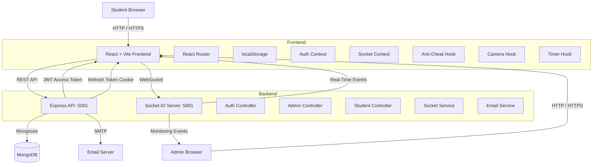

<div align="center">


# 🔥 DevPhoenix Assessment Platform

### Secure • Proctored • Real-Time Online Assessments

**A full-stack examination platform for creating, conducting, monitoring, and evaluating secure online assessments.**

<br/>


<br/>

[](https://react.dev/)
[](https://vitejs.dev/)
[](https://nodejs.org/)
[](https://expressjs.com/)
[](https://www.mongodb.com/)
[](https://socket.io/)
[](https://jwt.io/)

</div>

---

## 📌 About the Project

**DevPhoenix Assessment Platform** is a full-stack, proctored online examination system designed for secure and monitored assessments across multiple subject tracks, including:

- Cloud DevOps
- Web Development
- Data Science
- MERN Stack
- Other configurable assessment domains

The platform combines a modern React/Vite interface with a Node.js/Express backend, MongoDB persistence, JWT authentication, OTP-based verification, Socket.IO real-time communication, webcam/WebRTC capabilities, anti-cheat monitoring, and automated result reporting.

### Core Objectives

| Objective | Platform Capability |
|---|---|
| 📝 Create assessments | Subjects, questions, exams and shareable exam links |
| 🎓 Conduct exams | Guided student registration, system checks and live MCQ exams |
| 🛡️ Prevent cheating | Browser-event detection, warning system and automatic voiding |
| 👁️ Monitor students | Real-time heartbeats, cheat events and WebRTC camera streaming |
| 📊 Evaluate performance | Automated scoring, pass/fail status and answer breakdown |
| 📄 Generate reports | Excel exports, question templates and PDF result reports |

---

## ✨ Highlights

### 🎓 Student Examination Experience

- Exam access through shareable links
- Student registration and login
- Email OTP verification
- Forgot-password and password-reset flow
- Pre-exam system verification
  - Webcam access
  - Fullscreen mode
  - Internet connectivity
  - Guidelines review
- Live MCQ examination interface
- Question navigator
- Answer persistence
- Countdown timer
- Automatic submission on timeout
- Webcam preview
- Real-time anti-cheat warnings
- Detailed result breakdown
- Answer explanations
- Dedicated voided/cheated examination flow

### 👨‍💼 Administration

- Multi-admin login
- Subject management
- Question bank management
- Subject-based question filtering
- Exam creation and shareable links
- Student management
- Subject-based student filtering
- Result management
- Subject-based result filtering
- Student inline editing
- Student deletion
- Result clearing with confirmation
- Dashboard statistics
- Proctor audit logs
- Excel question import
- Excel report generation
- PDF result reports
- Force-void capability

### 🛡️ Proctoring & Anti-Cheat

The platform currently detects:

- Tab switching
- Fullscreen exit
- Refresh / browser-close attempts
- Internet loss
- Right-click
- Copy / paste
- Camera-related events
- Multiple-face / no-face proctoring events

The default warning threshold is **3**, configurable at the exam level.

---

## 🧰 Technology Stack

### Frontend

| Technology | Purpose |
|---|---|
| **React 18** | UI framework |
| **Vite** | Build tool and development server |
| **React Router v6** | Client-side routing |
| **Axios** | HTTP client |
| **Socket.IO Client** | Real-time communication |
| **Lucide React** | Icon library |
| **React Hot Toast** | Notifications |
| **Vanilla CSS** | Custom design system |

### Backend

| Technology | Purpose |
|---|---|
| **Node.js** | Runtime |
| **Express 5** | REST API |
| **MongoDB** | Database |
| **Mongoose** | ODM |
| **Socket.IO** | Real-time bidirectional communication |
| **jsonwebtoken** | JWT authentication |
| **bcryptjs** | Password hashing |
| **Nodemailer** | OTP email delivery |
| **Multer** | File uploads |
| **ExcelJS** | Excel generation/import |
| **PDFKit** | PDF result reports |
| **Morgan** | HTTP request logging |
| **cookie-parser** | Cookie handling |
| **dotenv** | Environment configuration |

---

## 🏗️ Architecture



### Communication Model

```text
                    ┌──────────────────────┐
                    │   Student / Admin    │
                    │       Browser        │
                    └──────────┬───────────┘
                               │
                 ┌─────────────┴─────────────┐
                 │                           │
             REST API                    WebSocket
                 │                           │
                 ▼                           ▼
        ┌─────────────────┐        ┌─────────────────┐
        │ Express Backend │        │  Socket.IO      │
        │     :5001       │        │     Server      │
        └────────┬────────┘        └────────┬────────┘
                 │                          │
          ┌──────┴──────┐          ┌────────┴────────┐
          │             │          │                 │
          ▼             ▼          ▼                 ▼
      MongoDB          SMTP     Monitoring       WebRTC
```

---

## 📁 Project Structure

```text
AI_assesment/
│
├── client/                              # React + Vite frontend
│   └── src/
│       ├── App.jsx                      # Main application
│       ├── App.css
│       ├── index.css
│       ├── main.jsx
│       │
│       ├── components/
│       │   ├── LoadingScreen.jsx
│       │   ├── LoadingScreen.css
│       │   └── StudentAuthModal.jsx
│       │
│       ├── context/
│       │   ├── AuthContext.jsx
│       │   └── SocketContext.jsx
│       │
│       ├── hooks/
│       │   ├── useAntiCheat.js
│       │   ├── useCamera.js
│       │   └── useTimer.js
│       │
│       ├── services/
│       │   └── api.js
│       │
│       └── pages/
│           ├── admin/
│           ├── auth/
│           └── student/
│
├── server/                              # Express backend
│   ├── index.js
│   ├── .env
│   │
│   ├── config/
│   │   └── db.js
│   │
│   ├── models/
│   │   ├── User.js
│   │   ├── Exam.js
│   │   ├── ExamSession.js
│   │   ├── Question.js
│   │   ├── Result.js
│   │   └── CheatingLog.js
│   │
│   ├── controllers/
│   │   ├── authController.js
│   │   ├── adminController.js
│   │   └── studentController.js
│   │
│   ├── routes/
│   │   ├── auth.js
│   │   ├── admin.js
│   │   └── student.js
│   │
│   ├── middleware/
│   │   ├── authMiddleware.js
│   │   └── errorHandler.js
│   │
│   └── services/
│       ├── socketService.js
│       └── emailService.js
│
├── database/
│   └── seed.js
│
├── uploads/
│   └── # Excel question uploads
│
└── README.md
```

---

## 🖥️ Application Routes

| Route | Component | Purpose |
|---|---|---|
| `/` | `HomePage` | Platform landing page |
| `/exam/:examId` | `StudentLanding` | Student registration and exam introduction |
| `/exam/:examId/setup` | `SystemCheck` | Pre-exam verification |
| `/exam/:examId/take` | `ExamTake` | Live examination |
| `/thankyou/:resultId` | `ThankYouPage` | Submission confirmation |
| `/result/:id` | `ResultPage` | Detailed result |
| `/cheated` | `CheatedPage` | Voided examination |
| `/admin` | `AdminLogin` | Administrator authentication |
| `/admin/dashboard` | `AdminDashboard` | Administration console |

---

# 🎓 Student Experience

## 1. Exam Landing

Students access a unique exam URL:

```text
/exam/:examId
```

The landing page displays the exam information and opens the authentication flow.

---

## 2. Student Authentication

`StudentAuthModal` supports:

| Mode | Function |
|---|---|
| `login` | Email + password |
| `register` | Name + email + password |
| `verify-otp` | Six-digit email verification |
| `forgot-password` | Password reset request |
| `reset-password` | OTP + new password |

### Registration Flow

```text
Exam Link
   ↓
Register
   ↓
Email OTP
   ↓
Verify OTP
   ↓
JWT Tokens
   ↓
System Check
   ↓
Start Exam
```

---

## 3. Pre-Exam System Check

Before entering an assessment, the platform performs:

1. 📹 Camera access check
2. 🖥️ Fullscreen check
3. 🌐 Internet connectivity check
4. 📋 Guidelines review

Only after the required checks pass can the student proceed.

---

## 4. Live Examination

The examination interface provides:

- Question navigator
- MCQ option cards
- Answer persistence
- Countdown timer
- Automatic timeout submission
- Webcam preview
- Warning counter
- Anti-cheat monitoring

The timer enters a warning state when **less than two minutes** remain.

---

## 5. Results

After submission, students can view:

- Overall score
- Percentage
- Pass/fail status
- Time taken
- Correct answers
- Incorrect answers
- Skipped questions
- Per-question answer breakdown
- Explanations
- Warning count

---

# 👨‍💼 Admin Dashboard

The administrator console is available at:

```text
/admin
/admin/dashboard
```

## Dashboard Sections

### Overview

Provides:

- Subject count
- Question count
- Active exam count
- Total students
- Recent submissions

### Subjects

Administrators can:

- Add subjects
- Edit subjects
- Delete subjects
- Assign color identifiers

### Question Bank

Administrators can:

- Add questions
- Edit questions
- Delete questions
- Assign questions to subjects
- Filter questions by subject
- Configure A/B/C/D options
- Set correct answers
- Set marks
- Add explanations

### Exam Links

Administrators can:

- Create exams
- Create multiple exams per subject
- Generate unique exam URLs
- Copy links
- Share through email / WhatsApp
- Delete exams

### Students

The student management area supports:

- Subject filtering
- Student counts by subject
- Inline name editing
- Student deletion
- Clear-all operation

### Results & Proctor Audit

The results area supports:

- Subject filtering
- Score viewing
- Warning count
- Pass/fail/cheated status
- Result details
- Proctor audit information
- Result clearing

---

# 🛡️ Anti-Cheat & Proctoring

The platform uses browser events, Socket.IO, session state, and webcam capabilities to enforce examination rules.

## Detection Matrix

| Event | Browser Mechanism |
|---|---|
| Tab switch | `document.visibilitychange` |
| Fullscreen exit | `document.fullscreenchange` |
| Refresh / close | `window.beforeunload` |
| Internet loss | `window.offline` |
| Right-click | `contextmenu` |
| Copy / paste | `copy` / `paste` |
| Camera off | Camera monitoring |
| Multiple faces | Proctoring event |
| No face | Proctoring event |

## Warning Lifecycle

```text
Violation
    ↓
useAntiCheat
    ↓
Socket.IO cheat-event
    ↓
Backend
    ↓
Increment warningCount
    ↓
Create CheatingLog
    ↓
Send warning-issued
    ↓
Update Admin Monitor
    ↓
warningCount >= maxWarnings?
    │
    ├── NO  → Continue Exam
    │
    └── YES → Void Session
                  ↓
              /cheated
```

### Default

```text
maxWarnings = 3
```

The exam model supports configuring this threshold.

---

# ⚡ Real-Time System

Socket.IO runs alongside Express on port `5001`.

## Rooms

| Room | Purpose |
|---|---|
| `exam:{examId}` | Student exam events |
| `monitor:{examId}` | Administrator monitoring |

## Student → Server

| Event | Purpose |
|---|---|
| `join-exam` | Join an exam room |
| `cheat-event` | Report a violation |
| `heartbeat` | Keep-alive signal |
| `question-change` | Report question navigation |

## Server → Student

| Event | Purpose |
|---|---|
| `warning-issued` | Display warning |
| `exam-voided` | Terminate exam |
| `heartbeat-ack` | Confirm heartbeat |

## Admin → Server

| Event | Purpose |
|---|---|
| `admin-join-monitor` | Join monitoring room |
| `admin-void-student` | Force-terminate session |
| `request-camera` | Request camera stream |

## Server → Admin

| Event | Purpose |
|---|---|
| `monitor-snapshot` | Active-session snapshot |
| `student-joined` | New student |
| `student-cheat-event` | Cheat alert |
| `student-heartbeat` | Student activity |
| `student-question-update` | Current question |
| `student-disconnected` | Student disconnected |
| `student-voided` | Student terminated |

---

# 📹 Webcam & WebRTC

The `useCamera` hook manages:

- `getUserMedia()` webcam access
- Camera start/stop
- Camera errors
- WebRTC peer connections
- ICE candidate exchange
- Admin-side camera streaming

### Signaling Events

```text
Student
   │
   ├── webrtc-offer ────────► Admin
   │
   ◄── webrtc-answer ─────── Admin
   │
   ◄────► webrtc-ice-candidate
```

---

# 🔐 Authentication & Authorization

The backend uses JWT-based authentication.

## Token Strategy

### Access Token

- Short-lived JWT
- Sent through:

```http
Authorization: Bearer <accessToken>
```

### Refresh Token

- Longer-lived
- Stored in an HTTP-only cookie

### Automatic Refresh

```text
API Request
    ↓
401 TOKEN_EXPIRED
    ↓
POST /api/auth/refresh
    ↓
New Access Token
    ↓
Retry Original Request
```

## Middleware

```text
protect
   ↓
requireAdmin / requireStudent
   ↓
requireVerified
   ↓
Controller
```

---

# 🔌 API Reference

Base URL:

```text
http://localhost:5001/api
```

## Authentication — `/api/auth`

| Method | Endpoint | Description |
|---|---|---|
| `POST` | `/register` | Register student |
| `POST` | `/verify-otp` | Verify email OTP |
| `POST` | `/resend-otp` | Resend OTP |
| `POST` | `/login` | Login |
| `POST` | `/forgot-password` | Request password reset |
| `POST` | `/reset-password` | Reset password |
| `POST` | `/refresh` | Refresh access token |
| `GET` | `/me` | Current user |
| `POST` | `/logout` | Logout |

## Admin — `/api/admin`

Requires JWT + Admin role.

| Method | Endpoint | Description |
|---|---|---|
| `GET` | `/stats` | Dashboard statistics |
| `GET` | `/exams` | List exams |
| `POST` | `/exams` | Create exam |
| `GET` | `/exams/:id` | Exam details |
| `PUT` | `/exams/:id` | Update exam |
| `DELETE` | `/exams/:id` | Delete exam |
| `PATCH` | `/exams/:id/publish` | Publish/unpublish |
| `GET` | `/exams/:id/questions` | Get questions |
| `POST` | `/exams/:id/questions` | Add question |
| `POST` | `/exams/:id/questions/bulk` | Excel bulk upload |
| `PUT` | `/questions/:id` | Update question |
| `DELETE` | `/questions/:id` | Delete question |
| `GET` | `/sessions/active` | Active sessions |
| `GET` | `/results` | Results |
| `GET` | `/cheat-logs` | Cheat logs |
| `GET` | `/reports/excel` | Excel report |
| `GET` | `/reports/pdf/:resultId` | PDF result |
| `GET` | `/reports/question-template` | Excel question template |

## Student — `/api/student`

Requires JWT + Student role + verified email.

| Method | Endpoint | Description |
|---|---|---|
| `GET` | `/exams` | Available exams |
| `POST` | `/exams/:id/start` | Start session |
| `POST` | `/exams/:id/save-answer` | Save answer |
| `POST` | `/exams/:id/submit` | Submit exam |
| `GET` | `/results` | Student results |
| `GET` | `/results/:id` | Result details |

---

# 🗃️ Database Models

## User

```text
name
email
password
role
isVerified
otp
otpExpiry
profileImage
refreshToken
createdAt
updatedAt
```

## Exam

```text
title
description
duration
totalMarks
passingMarks
startTime
endTime
isPublished
allowResume
maxWarnings
shuffleQuestions
showResultImmediately
createdBy
questionCount
createdAt
updatedAt
```

## Question

```text
examId
questionText
options { A, B, C, D }
correctAnswer
marks
negativeMark
explanation
order
createdAt
updatedAt
```

## ExamSession

```text
studentId
examId
status
startedAt
submittedAt
timeRemaining
answers
currentQuestion
warningCount
lastActive
questionOrder
createdAt
updatedAt
```

## Result

```text
studentId
examId
sessionId
totalQuestions
attempted
correct
wrong
skipped
score
totalMarks
percentage
isPassed
timeTaken
answerBreakdown
calculatedAt
createdAt
updatedAt
```

## CheatingLog

```text
studentId
examId
sessionId
eventType
details
warningNumberAtEvent
timestamp
```

---

# 🪝 Custom Hooks

## `useAntiCheat`

```js
useAntiCheat({
  examId,
  studentId,
  active,
  onWarning,
  onVoided
})
```

Returns:

```js
{ reportEvent }
```

Responsible for attaching and reporting anti-cheat events.

---

## `useCamera`

```js
useCamera({
  enabled,
  examId,
  studentId,
  onCameraOff
})
```

Returns:

```js
{
  videoRef,
  cameraActive,
  cameraError,
  startCamera,
  stopCamera,
  stream
}
```

Responsible for webcam and WebRTC camera functionality.

---

## `useTimer`

```js
useTimer({
  duration,
  onComplete
})
```

Returns:

```js
{
  timeLeft,
  formatted,
  isWarning
}
```

---

# 🧩 Services

## Client — `api.js`

Responsibilities:

- Axios configuration
- `/api` base URL
- Access-token attachment
- Automatic token refresh
- Authentication failure handling

The documented implementation also includes Render deployment detection for:

```text
ai-assessment-rkk7.onrender.com
```

---

## Server — `emailService.js`

Uses Nodemailer for:

- Registration OTP
- Password-reset OTP
- Branded HTML email delivery

---

## Server — `socketService.js`

Responsible for:

- Socket authentication
- Exam rooms
- Monitoring rooms
- Cheat events
- Heartbeats
- Admin monitoring
- Auto-voiding
- WebRTC signaling

---

# 👤 Current Admin Accounts

> ⚠️ **Development-only credentials**

| Full Name | Login ID | Password | Subject |
|---|---|---|---|
| Nilesh Maity | `nilesh` | `datascience2026` | Data Science |
| Rohit Pandit | `rohit` | `MERN2026` | MERN Stack |
| Prakash Halwai | `prakash` | `Devops2026` | Cloud DevOps |

### Production Warning

These credentials are currently hardcoded in the frontend and stored in plain text.

For production, migrate administrator authentication to the backend JWT authentication system.

---

# ⚙️ Environment Variables

## Server `.env`

```env
# Database
MONGODB_URI=mongodb://localhost:27017/examplatform

# JWT
JWT_SECRET=your_jwt_secret_key
JWT_EXPIRE=15m
JWT_REFRESH_SECRET=your_refresh_secret
JWT_REFRESH_EXPIRE=7d

# Server
PORT=5001
NODE_ENV=development
CLIENT_URL=http://localhost:5173

# SMTP
EMAIL_HOST=smtp.gmail.com
EMAIL_PORT=587
EMAIL_USER=your@email.com
EMAIL_PASS=your_app_password

# OTP
OTP_EXPIRE_MINUTES=10
```

## Client `.env`

```env
VITE_API_URL=http://localhost:5001
```

> Never commit real credentials, SMTP passwords, JWT secrets, or production database credentials to Git.

---

# 🚀 Getting Started

## Prerequisites

Install:

- Node.js
- npm
- MongoDB
- Git

## 1. Clone the Repository

```bash
git clone <repository-url>
cd AI_assesment
```

## 2. Install Backend Dependencies

```bash
cd server
npm install
```

Configure the server `.env` file.

## 3. Start Backend

```bash
npm run dev
```

Backend:

```text
http://localhost:5001
```

## 4. Install Frontend Dependencies

Open another terminal:

```bash
cd client
npm install
```

## 5. Start Frontend

```bash
npm run dev
```

Vite normally uses:

```text
http://localhost:5173
```

If the port is occupied, Vite uses the next available port.

## 6. Seed the Database

```bash
cd server
npm run seed
```

---

# 💾 Current Data Storage

The current admin dashboard uses **browser `localStorage` as its primary data store**.

Data is namespaced with the `dp_` prefix.

| Key | Purpose |
|---|---|
| `dp_subjects` | Subject areas |
| `dp_questions` | Question bank |
| `dp_exams` | Exam links |
| `dp_results` | Submitted results |
| `dp_students` | Registered students |

### Current Seed Data

The documented frontend initializes:

- 2 default subjects
  - Web Development
  - Data Structures
- 4 seed questions
- 1 demo exam
  - Web Dev Assessment

---

# ⚠️ Important Architecture Note

The current project contains **two data layers**:

### 1. Frontend Local-First Layer

```text
React UI
   ↓
localStorage
   ↓
Subjects / Questions / Exams / Students / Results
```

### 2. Backend Application Layer

```text
React
   ↓
REST API
   ↓
Express
   ↓
MongoDB
```

Alongside:

```text
Socket.IO
WebRTC
JWT
OTP Email
Excel Reports
PDF Reports
```

The backend APIs and real-time infrastructure are documented as **implemented but not yet fully wired into the current frontend dashboard UI**.

This should be treated as an important transition point before production deployment.

---

# 📊 Data Relationships

```text
Subject
   │
   ├──────────────► Questions
   │
   └──────────────► Exams
                         │
                         ├────────► Students
                         │
                         └────────► Results
                                      │
                                      └────► Exam
```

---

# 📈 Feature Status

## Student & Examination

- [x] Animated loading screen
- [x] Student registration
- [x] Student login
- [x] Email OTP verification
- [x] Forgot password
- [x] Password reset
- [x] Exam landing page
- [x] Pre-exam system check
- [x] Camera access
- [x] Fullscreen verification
- [x] Internet check
- [x] Live MCQ exam
- [x] Question navigator
- [x] Countdown timer
- [x] Automatic submission
- [x] Webcam monitoring
- [x] Result breakdown
- [x] Answer explanations
- [x] Cheated/voided flow

## Anti-Cheat & Monitoring

- [x] Tab-switch detection
- [x] Fullscreen-exit detection
- [x] Refresh detection
- [x] Browser-close detection
- [x] Internet-loss detection
- [x] Right-click detection
- [x] Copy/paste detection
- [x] Camera monitoring
- [x] Warning system
- [x] Automatic session voiding
- [x] Socket.IO monitoring
- [x] Heartbeat monitoring
- [x] WebRTC signaling
- [x] Admin force-void

## Administration

- [x] Multi-admin login
- [x] Subject management
- [x] Question management
- [x] Subject filtering
- [x] Exam creation
- [x] Shareable exam links
- [x] Student management
- [x] Student subject filtering
- [x] Student editing
- [x] Student deletion
- [x] Result management
- [x] Result subject filtering
- [x] Proctor audit logs
- [x] Excel reports
- [x] PDF reports
- [x] Confirmation modals

## Backend Infrastructure

- [x] Express API
- [x] MongoDB/Mongoose models
- [x] JWT authentication
- [x] Refresh-token flow
- [x] OTP email service
- [x] Exam lifecycle APIs
- [x] Exam session lifecycle
- [x] Result calculation
- [x] Cheating logs
- [x] Socket.IO service
- [x] WebRTC signaling
- [x] Bulk Excel question upload
- [x] Excel reporting
- [x] PDF reporting

---

# 🔮 Recommended Production Roadmap

The next improvements should focus on **architecture and security before additional UI features**.

### Priority 1 — Backend as the Source of Truth

Replace the current localStorage-first admin data flow with:

```text
React
  ↓
Authenticated REST API
  ↓
MongoDB
```

### Priority 2 — Secure Admin Authentication

Move hardcoded admin credentials into backend authentication.

```text
Admin Login
   ↓
POST /api/auth/login
   ↓
JWT
   ↓
Role Validation
   ↓
Admin Dashboard
```

### Priority 3 — Production Security

- HTTPS
- Strong JWT secrets
- Secure refresh-token handling
- CORS restrictions
- Authentication rate limiting
- OTP rate limiting
- Server-side input validation
- Secure file-upload validation
- Centralized audit logging

### Priority 4 — Reliability

- Automated backend tests
- Exam lifecycle tests
- Scoring tests
- API error monitoring
- Health checks
- Structured logs
- Production deployment configuration

### Priority 5 — Proctoring Hardening

Browser-based anti-cheat systems have limitations. Before using the platform for high-stakes examinations, validate:

- Camera failure handling
- Network interruption recovery
- False-positive warning behavior
- WebRTC failure handling
- Multi-face/no-face detection accuracy
- Session recovery
- Admin monitoring reliability

---

# 🔐 Security Checklist

Before production:

- [ ] Remove hardcoded admin credentials
- [ ] Move authentication fully server-side
- [ ] Use HTTPS
- [ ] Rotate all secrets
- [ ] Restrict CORS
- [ ] Add rate limiting
- [ ] Validate all API input
- [ ] Validate uploaded Excel files
- [ ] Protect every admin endpoint
- [ ] Protect refresh-token cookies
- [ ] Never commit `.env`
- [ ] Add centralized audit logs
- [ ] Add automated tests
- [ ] Add production monitoring
- [ ] Test proctoring failure scenarios

---

# 📚 Documentation Source

This README is structured from the project's supplied full technical documentation, including its frontend architecture, backend API surface, database models, Socket.IO events, anti-cheat behavior, authentication flow, environment configuration, localStorage model, and current feature status.

For the original project documentation, see the supplied project document: fileciteturn0file0

---

<div align="center">


### 🔥 DEVPHOENIX

**Building Intelligent Digital Ecosystems**

Secure Assessments • Real-Time Monitoring • Automated Evaluation

</div>
